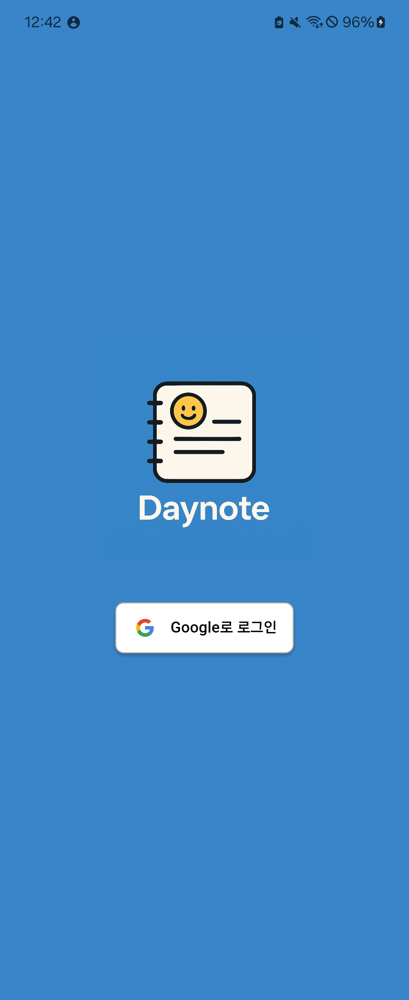
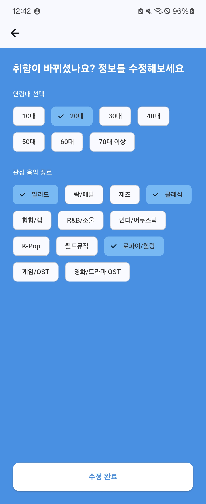
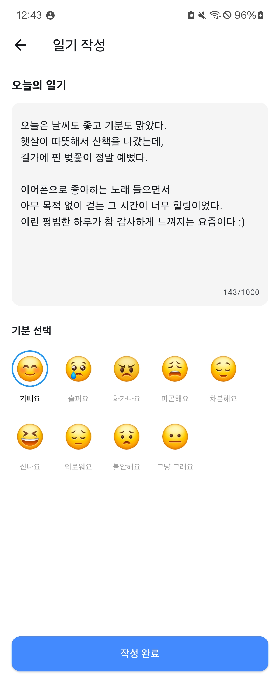
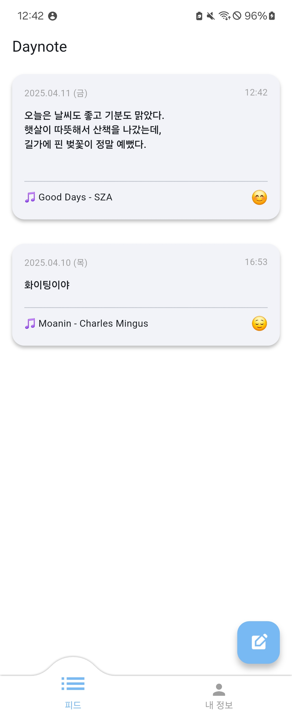
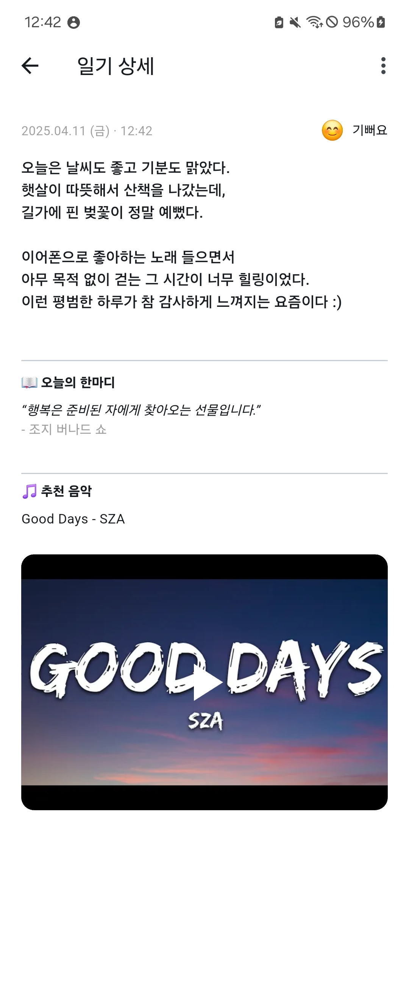
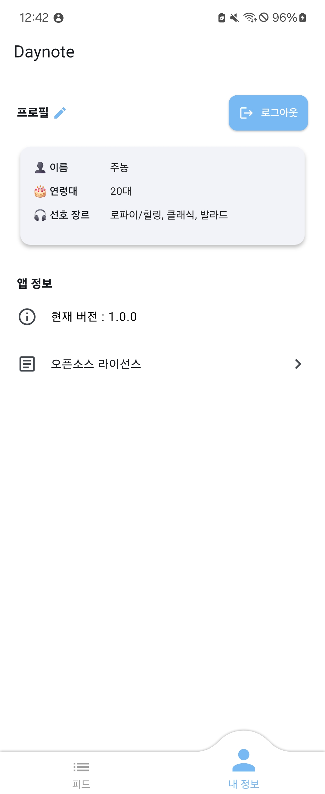

# 🌙 Daynote

감정에 따라 음악과 명언을 추천해주는 감성 일기 앱  
**Flutter + Firebase + OpenAI 기반 사이드 프로젝트입니다.**

---

## 📱 주요 기능

- 📓 일기 작성 + 감정 선택
- 🧠 GPT 기반 음악/명언 추천 (JSON Response API 사용)
- 🎧 유튜브 자동 검색 + 영상 링크 연결
- 📺 썸네일 미리보기 → 영상 전체 재생
- 🔄 무한 스크롤 피드 & 실시간 업데이트
- 🧑 사용자 연령대, 음악 취향 설정
- 🔐 구글 로그인 + 상태 유지
- ⚙️ 앱 버전 및 오픈소스 라이선스 표시

---

## 🛠 기술 스택

| 항목 | 내용 |
|------|------|
| **프레임워크** | Flutter (GetX, freezed 등) |
| **백엔드** | Firebase Auth, Firestore |
| **AI 추천** | OpenAI GPT-4 (`response_format: json`) |
| **영상 연동** | YouTube Data API v3 |
| **상태 관리** | GetStorage, GetX |
| **기타** | Convex Bottom Bar, PackageInfo 등 |

---

## 📁 디렉토리 구조 (일부)

```
lib/
├── constant/            # enum, converter 같은 상수
├── models/              # freezed 모델 정의
├── services/            # OpenAI / YouTube 연동
├── modules/
│   ├── ~/               # view, GetX controller
├── routes/              # RoutePage 목록
├── utils/               # 공통 함수 등 유틸리티 클래스
└── main.dart
```

---

## 🧪 실행 방법

```bash
git clone https://github.com/your-id/daynote.git
cd daynote
flutter pub get
flutter run
```

---

## 🔐 환경 변수 (.env 예시)

```
OPENAI_API_KEY=your_openai_key
YOUTUBE_API_KEY=your_youtube_key
```

---
## 📸 주요 화면

### 🔐 로그인 화면  
구글 로그인으로 간편하게 시작할 수 있어요.  


---

### 🧑 프로필 설정 화면  
닉네임, 연령대, 선호 음악 장르를 선택해요.  


---

### 📝 피드 작성 화면  
일기와 기분을 입력하면 AI가 음악과 명언을 추천해줘요.  


---

### 📄 피드 목록 화면  
내가 쓴 일기를 무한 스크롤로 확인할 수 있어요.  


---

### 📌 피드 상세 화면  
추천된 명언과 음악, 유튜브 썸네일까지 확인할 수 있어요.  


---

### ⚙️ 내 정보 화면  
이름, 선호 장르, 연령대, 앱 버전 및 로그아웃까지 확인할 수 있어요.  



---

## 📄 라이선스

MIT License

---

## 🙋‍♂️ 개발자

- GitHub: [@ora16382](https://github.com/ora16382)
- Email: ora16382@email.com